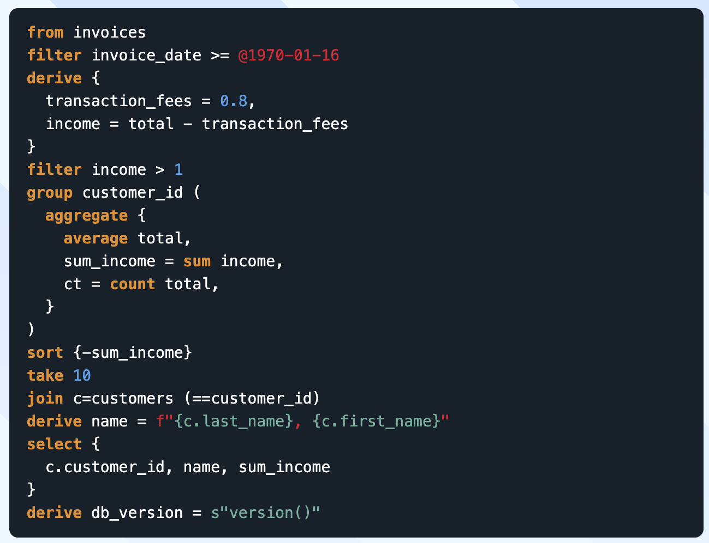
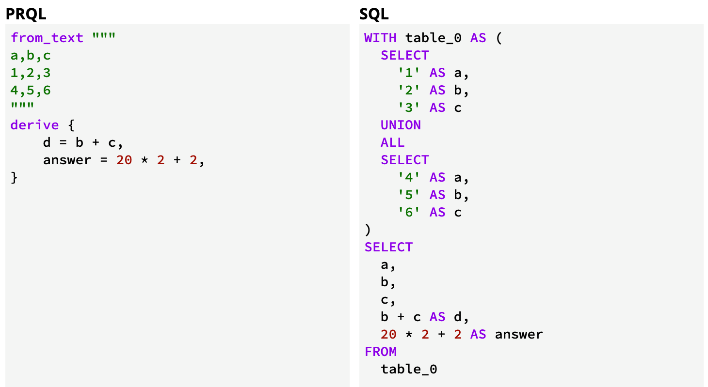
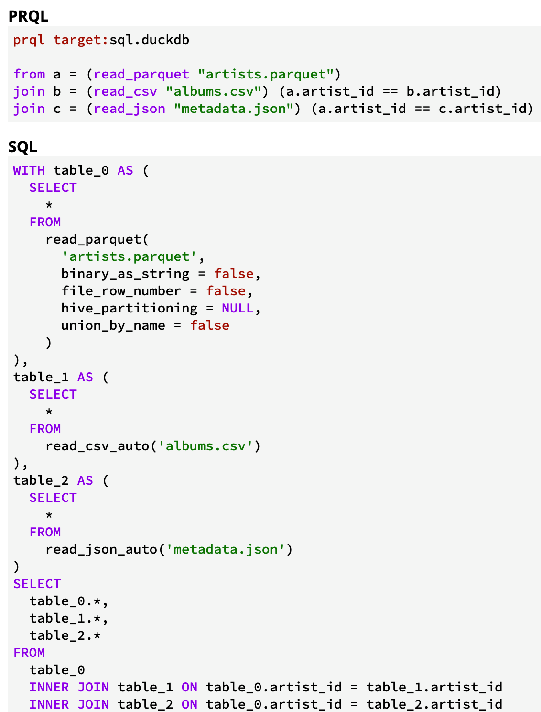

# NUH - PRQL / The Stack

(internal presentation ONLY - very informal)

---

## Problem

- We have complicated queries with lots of data to run against a read-only SQL Server database
- NDO lists > 100 rows to select against
- Multiple overlapping queries to group/regroup data from SACT/COSD/...
- Security says ... please only use .sql files ...
  - ... don't connect new software to the NUH system ...

---

## Possible Solution; a pre-SQL stack/tool?

- Turn something more ... legible ... into SQL
- Run locally or on BC Insight when ready
- Inline .csv files into CTE subqueries

> This solution is “weird” because it isn't TurnKey and implies we need to work around the current trust model. It’s not sneaking anything in though - it’s just automating copy/paste work for writing `.sql` queries.

---

## PRQL - PreSQL

---

### PRQL – PreSQL (Example)

- Not "married to" the idea of this language
- ... and usage will have a lot of Googl'ing

The goal is more-concise than the Götterdämmerung style `.sql` we use now. Embed `.csv` and/or import `.sql` or other queries.

Maybe just an `.sql` rewriter?

---

### PRQL – CTE from `.csv` text

When compiled, a blurb of CSV becomes a CTE expression.

> I don't know if 100+ NDO records are too much

---

### PRQL – Importing from `.csv` file

The builtin syntax exists, but, it's limited to DuckDb. We can perform string substitution with Python before compiling it.

> I've checked and this is ... fine?
> `.csv` substitution worked on Friday afternoon.

---

## The Stack

- this isn't a complex Python setup
- creating `.sql` can be run on BC Insights

---

### (Future?) Automate CDM with The Stack

Using an existing `.xlsx` file as a template, and the `sheet_config:{...}` from date shifting, automate the creation of date-shifted documents.

> ... or skip the shifting step until later ...

_Just_ need a python script that digests the configuration and prompts the user to query / save results to `.csv` and combine into new queries.

> ... and add something like `ROWCOUNT(*) AS row_count` then check it to verify of the results are complete ...

---

## What's Wrong?

So what's wrong with this approach?

- Provenance and Auditing
  - want to know who ran what when
- Yet Another Internal Tool
- odd new language
  - ... which none of us know?
- "operator in the middle"
  - ask dev to exec query
  - ... and save results as ...

- no external log of what was run
  - ... we can write text logs though ...
- it's another new internal tool
- PRQL is an esoteric language
  - ... could maybe swap `.sql`?
- complex usage needs to run SQL
  - python could run `ssms.exe`
  - ONLY to open the `.sql`

... so ... I expect this approach could be heckled to pieces and reassembled into something more conventional.

---

## Solutions For Now ...

- ~~complicated queries~~
  - more expressive query language
- ~~NDO lists~~
  - substitute them into the queries when compiled
- ~~overlapping queries~~
  - re-use multiple smaller shared sub-queries
- ~~Security / only use .sql~~
  - we're running the generated `.sql` by hand

---

## À la fin

So the big ideas are;

- perform string substitution to get _better_ `.sql` with less work
  - possibly with fancier not-SQL language
- prompt Human to run the generated `.sql`
  - maybe using fancy steps
    - opening it for them
    - checking the results have enough rows
- never ever save the generated `.sql` or `.csv` to git
